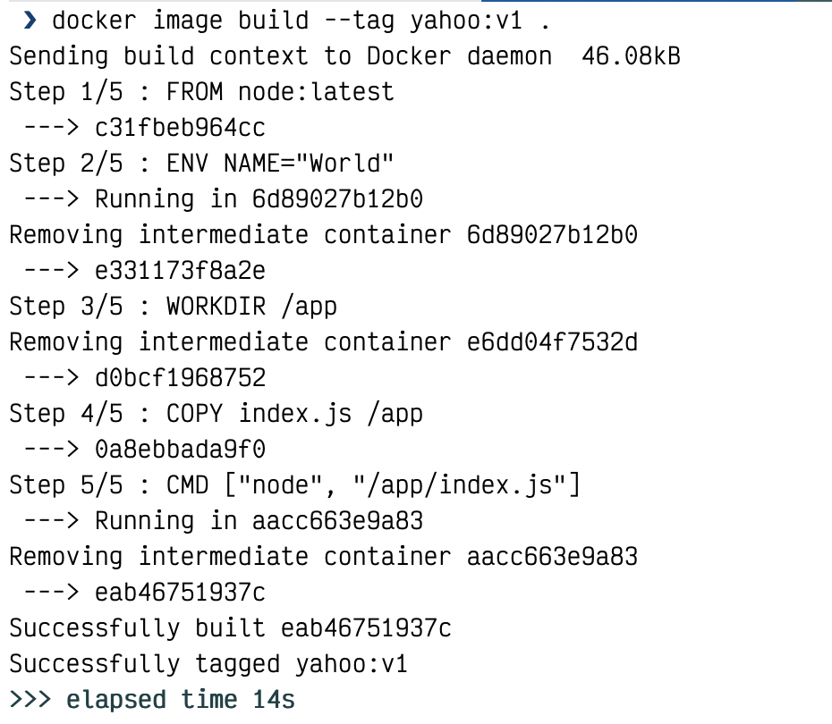
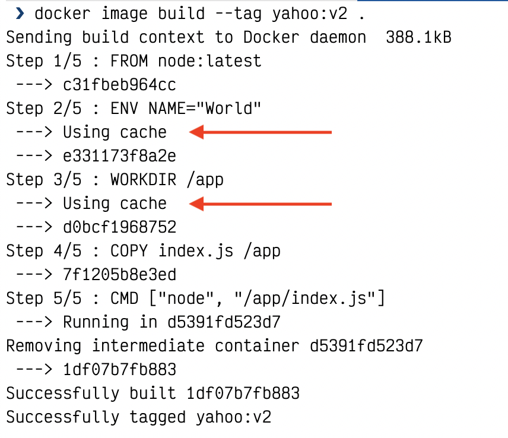
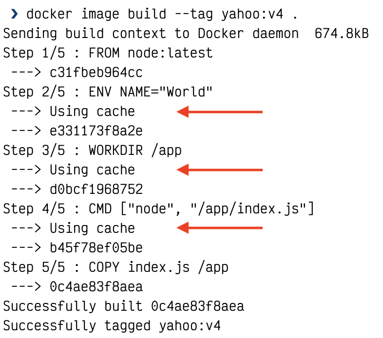

# Dockerfile Optimisations
> Any Dockerfile you write should be optimized so that the instructions are ordered by how frequently they change – with instructions that are unlikely to change at the start of the Dockerfile, and instructions most likely to change at the end.”

Excerpt From: Elton Stoneman. **Learn Docker in a Month of Lunches**.

## Instructions
1. Copy the `Dockerfile_not_optimized` and build an image by running
    ```
    cp Dockerfile_not_optimized Dockerfile
    docker image build --tag yahoo:v1 .
    ```
    Note: Do not forget the `.` at the end
    
    Take note of the output of the command
    
2. Now change the `index.js` file by changing the word `Hello` to something else
3. Now build the image again.
    ```
    docker image build --tag yahoo:v2
    ```
    
    There's a slight difference between the first and second builds. Docker is actually caching instructions that haven't change since the last build. This is important to notice since this could save extra time when building images in production.
    
    Even though the last instruction `CMD ["node", "/app/index.js"]` did not change, Docker didn't use the cached data. This is because when the Docker detected the change at the `COPY index.js /app/index.js`, any instructions below it is rebuilt as well.
4. Now, delete the `Dockerfile` and make a copy of the `Dockerfile_optimized` and build the image again.
    ```
    rm Dockerfile
    cp Dockerfile_optimized Dockerfile
    docker image build --tag yahoo:v3
    ```
    
    Again, make sure to read the output. Since, the Dockerfile instructions order changed, Docker still rebuilt the last two instructions, which should be clear because there is not indication that a cached was used.
5. Now, again change the `index.js` file again and rebuild the image
    ```
    docker image build --tag yahoo:v4
    ```
    
    Note that all instructions are built from cache except for the `COPY` command! This should translate into faster builds in the future.
